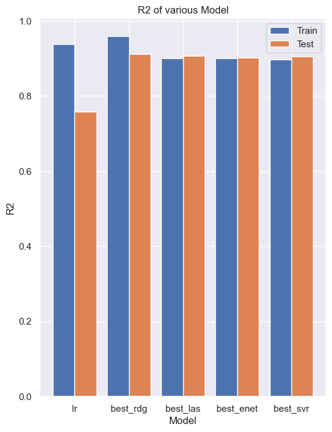
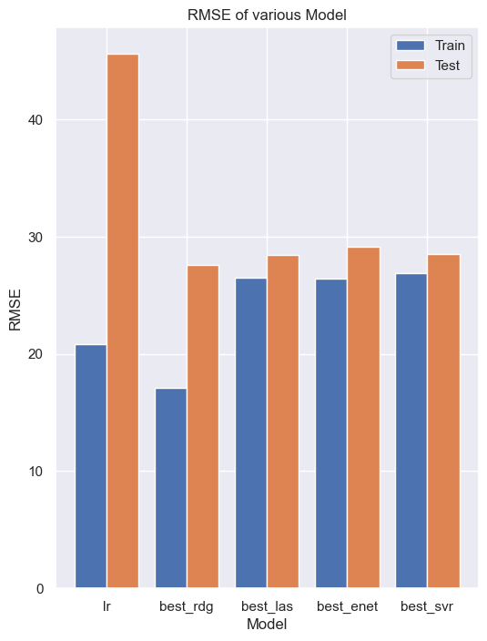
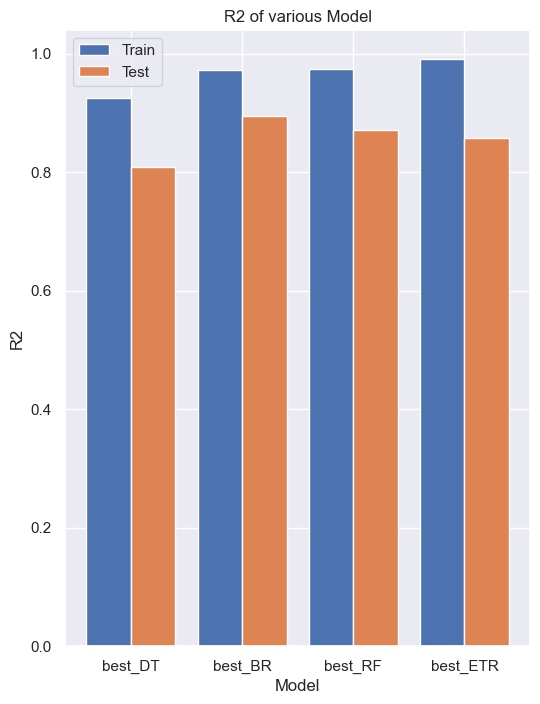
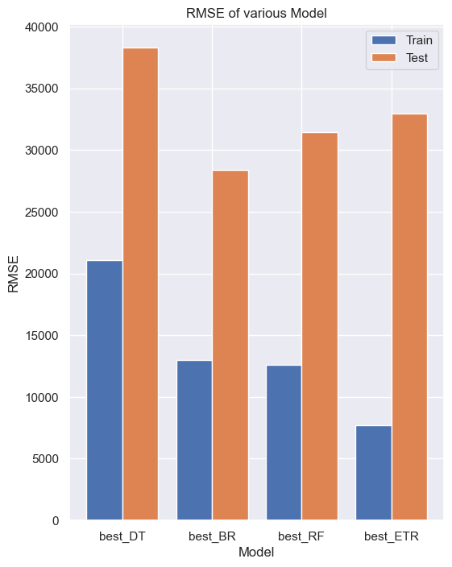

# House Prices Prediction: Regression Modeling

## Overview

This repository contains a comprehensive analysis and implementation of various regression models for predicting house prices based on the Kaggle competition ["House Prices: Advanced Regression Techniques"](https://www.kaggle.com/c/house-prices-advanced-regression-techniques). The project covers both tree-based and non-tree-based models, comparing their performance and selecting the best-performing models.

## Dataset

The dataset used for this project is provided by Kaggle and can be found [here](https://www.kaggle.com/c/house-prices-advanced-regression-techniques/data). It includes features related to residential homes in Ames, Iowa.

## Models Explored

### Non-Tree Based Models

- **Linear Regression**
- **Lasso Regression**
- **Ridge Regression**
- **Elastic Net**
- **Support Vector Regressor (SVR)**


### Tree-Based Models

- **Decision Trees**
- **Random Forest**
- **Bagiing Regressor**
- **Extra Random Trees**
Each model was finetuned using grid-Search CV and the best performance was obtained. The below graphs show the Performance of Non-tree based and Tree-based models
on training and Testing set.


## Notebooks

- **`Tree_Models.ipynb`:** Jupyter notebook containing the implementation and comparison of tree-based models.
- **`Non_Tree_Models.ipynb`:** Jupyter notebook focusing on the exploration and selection of non-tree-based models.

## PDF 
-- In the Repository entire Notebook is saved as a pdf as well with the name "Completed_project.pdf"
-- Feel free to see and explore the results.

## Results
 | 
------------------------|------------------------
 | 


The selected tree-based model(Bagging Regressor) achieved an impressive R2 score of 0.9716 on training and 0.895 on testing data, outperforming other contenders. Similarly, the chosen non-tree-based model(SVR) demonstrated superior predictive capabilities with R2 score of 0.897 on training and 0.905 on testing data.

## Instructions for Replication

1. Clone this repository:
   ```bash
   git clone https://github.com/your-username/house-prices-prediction.git
